# 📊 Solana Wallet Tracker & AMM Calculator
## Technical Proposal & Architecture Design

> **"Standing on the shoulders of giants – leverage existing data instead of crawling blockchain ourselves"**

---

## 📋 Executive Summary

We propose building a **Solana Wallet Tracker & AMM Calculator** - a specialized tool that helps traders and investors:
1. **Track wallet transactions** with detailed PnL analysis
2. **Calculate money needed** to push any token's market cap to target levels (100k, 200k, 1M...)
3. **Holder distribution** and whale movements
4. **Auto price feed** with real-time updates

**Core Problems Solved:** 
- "Which wallets are buying this token and at what prices?" 
- "How much SOL needed to push token X to 100k market cap?"
- "What's my PnL and average buy/sell prices?"

**Competitive Advantages:**
- ⚡ **3 weeks delivery** - fastest time-to-market
- 💰 **$3,000 fixed price** - extremely competitive
- 🏢 **$100-129/mo operating cost** - VPS + APIs with free tiers
- 🚀 **WebSocket real-time** - sub-second data updates
- 📊 **95% cache hit rate** - minimal API costs

### 🎯 Core Value Proposition

| Metric | Value | vs Competitors |
|--------|-------|----------------|
| ⚡ **Response Time** | <500ms | 6x faster |
| 💰 **Operating Cost** | $100-129/month | 97% cheaper (VPS + APIs) |
| 💵 **Development Cost** | $3,000 (240 hours) | Extremely competitive |
| 📊 **Data Accuracy** | 99.9% | Enterprise-grade |
| 🔄 **Data Freshness** | 2-30s (auto/manual) | Adaptive & flexible |
| 🚀 **Time to Market** | 3 weeks | 5x faster |

### 💡 Key Differentiators

Instead of investing hundreds of thousands to crawl blockchain and build custom infrastructure, we **leverage existing enterprise APIs** (Helius, Birdeye, Jupiter, DEX APIs) combined with **intelligent on-demand caching** to:

- ✅ Reduce 99% development cost
- ✅ Reduce 99% API calls through stale-while-revalidate caching (customizable TTL 2-30s per token popularity)
- ✅ 10x faster response time
- ✅ Guarantee 99.9% uptime

### 🎯 Why On-Demand + WebSocket vs Background Worker?

| Criteria | Background Worker | **On-Demand + WebSocket (Our Solution)** |
|----------|-------------------|------------------------------------------|
| **Complexity** | High - needs queue system | **Low** - Redis cache + Pub/Sub only |
| **Cost** | $154/mo | **$100-129/mo** (saves 16-35%) |
| **Development time** | 6 weeks | **3 weeks** (50% faster) |
| **API waste** | Refreshes all tokens every X seconds | **Only refresh when viewed** |
| **Real-time updates** | Polling interval 5-10s | **WebSocket push <100ms** |
| **Frontend cache** | Needed to reduce polling | **Not needed - backend push** |
| **Data consistency** | Risk of stale cache | **Always fresh - single source** |
| **Bugs potential** | Higher - many moving parts | **Lower** - simpler |
| **Maintenance** | Monitor queues + workers | **Easy** - stateless backend |
| **Scaling** | Vertical + Horizontal | **Horizontal only** (easier) |

**Key Insight:**
> In reality, **only 5-10% of tokens are viewed frequently**. Background workers waste 90% API calls on tokens nobody cares about. **On-demand + WebSocket approach:**
> - ✅ **Only fetch when user actually views** → maximize API cost savings
> - ✅ **WebSocket push updates** → no polling needed, data always fresh
> - ✅ **Backend-only cache** → single source of truth, zero consistency issues

---

## 🎯 1. Problem Statement

### 1.1 Trader/Investor Pain Points

| Problem | Impact | Our Solution |
|---------|--------|--------------|
| **Don't know how much money needed** | Guess blindly → lose on slippage | AMM calculator with accurate pool math |
| **Price impact unclear** | Buy first, realize high slippage later | Pre-calculate exact price impact |
| **No wallet tracking** | Can't track specific wallets' trades | Comprehensive wallet transaction history |
| **Manual PnL calculation** | Time-consuming, error-prone | Auto-calculate PnL, avg buy/sell prices |
| **No holder insights** | Can't see whale movements | Holder distribution + top holders analysis |
| **Can't plan market cap push** | Don't know budget needed | Calculate exact SOL needed per MC milestone |

### 1.2 Market Gap

Currently **no tool** in Solana ecosystem offers:
- ✅ Accurate calculation of money needed to reach target market cap
- ✅ Full AMM transaction simulation with pool math
- ✅ Wallet-specific transaction tracking with PnL
- ✅ Holder distribution analysis (whale/taker/maker)
- ✅ Multi-milestone planning (100k, 200k, 1M...)
- ✅ Combined: Tracking + Analysis + Planning in one place

---

## 🏗️ 2. Technical Architecture

### 2.1 System Overview (Real-time Backend Architecture)

```mermaid
graph TD
    U[👤 User Browser] -->|HTTPS REST| LB[⚖️ Load Balancer]
    U -.->|WebSocket| WS[🔌 WebSocket Gateway]
    LB --> BE1[🔷 NestJS API #1]
    LB --> BE2[🔷 NestJS API #2]
    WS --> BE1
    WS --> BE2
    BE1 --> RC[(⚡ Redis Cache<br/>+ Pub/Sub<br/>+ Distributed Lock)]
    BE2 --> RC
    BE1 --> DB[(🗄️ PostgreSQL<br/>+ TimescaleDB)]
    BE2 --> DB
    BE1 -->|Parallel Fetch| H[🌐 Helius API]
    BE1 -->|Parallel Fetch| B[🦅 Birdeye API]
    BE1 -->|Parallel Fetch| F[📊 Flipside API]
    BE1 -->|Parallel Fetch| J[🪐 Jupiter API]
    RC -->|Pub/Sub notify| WS
    WS -.->|Push updates| U
```



**Backend-centric Architecture with Real-time Push:**
- ✅ **Backend-only caching** - no frontend/CDN cache → always fresh data
- ✅ **WebSocket real-time** - push updates when cache refreshes → no polling needed
- ✅ **Redis Pub/Sub** - broadcast cache updates to all WebSocket clients
- ✅ **On-demand refresh** - only fetch when user requests
- ✅ **Stale-while-revalidate** - return stale cache + async refresh + push update via WebSocket
- ✅ **PostgreSQL + TimescaleDB** - store historical data for analytics
- ✅ **Distributed locking** - prevent thundering herd, eliminate duplicate API calls
- ✅ **Stateless backend** - easy horizontal scaling

### 2.2 Detailed Data Flow (Backend-centric with WebSocket)

#### **Scenario 1: Cache Hit - Fresh Data (85% requests)**
```
1. User Request → REST API → Redis Check → Cache Hit (fresh, <30s)
2. Return cached data immediately
3. Response time: 50-100ms ⚡

Frontend: Display data instantly
```

#### **Scenario 2: Cache Hit - Stale Data + WebSocket Push (10% requests)**
```
1. User Request → REST API → Redis Check → Cache Hit (stale, 30-60s)
2. Return stale data immediately (100ms)
3. Trigger async refresh in background (non-blocking)
   ├─ Fetch fresh data from APIs (parallel)
   ├─ Save to Redis + PostgreSQL
   └─ Publish to Redis Pub/Sub channel
4. Redis Pub/Sub → Notify WebSocket Gateway
5. WebSocket → Push fresh data to ALL connected clients watching this token
6. Frontend: Auto-update UI without polling

Strategy: Stale-While-Revalidate + Real-time Push
```

#### **Scenario 3: Cache Miss (5% requests)**
```
1. User Request → REST API → Redis Check → Cache Miss
2. Acquire Distributed Lock (TTL: 10s) - only 1 request can fetch
3. Other concurrent requests → Wait 500ms → Read from cache (updated by first request)
4. First request:
   ├─ Fetch from APIs in parallel (Helius + Birdeye + Jupiter)
   ├─ Aggregate & normalize data
   ├─ Save to Redis (TTL=60s) + PostgreSQL
   ├─ Publish to Redis Pub/Sub
   └─ Release Lock
5. WebSocket → Push to all subscribers
6. Response time: 500-800ms (first time only or cache expired)
```

### 2.3 WebSocket Real-time Strategy

**Channel subscription pattern:**
```
Client connects → Subscribe to token channels
Client: ws.subscribe('token:EPjFWdd5AufqSSqeM2qN1xzybapC8G4wEGGkZwyTDt1v')
Backend: Track subscriber → Add to Redis Set
```

**Broadcast strategy:**
```
Cache refresh event → Redis Pub/Sub publish
Topic: "token:refresh:{address}"
Payload: { tokenAddress, data, timestamp }
→ WebSocket Gateway receives
→ Broadcast to all clients subscribed to this token
→ Clients auto-update UI
```

**Connection management:**
- ✅ Heartbeat every 30s - detect dead connections
- ✅ Auto-reconnect with exponential backoff
- ✅ Resume from last known state
- ✅ Stateless: WebSocket state stored in Redis only

**Benefits:**
- ✅ **No polling needed** - zero unnecessary requests
- ✅ **Sub-second latency** - push in <100ms
- ✅ **Efficient** - 1 API call → broadcast to N clients
- ✅ **Scalable** - Redis Pub/Sub handles millions msgs/sec

### 2.4 Backend Caching Strategy (Single Source of Truth)

**Why Backend-only caching?**
- ✅ **Single source of truth** - absolute data consistency
- ✅ **Zero stale data on client** - WebSocket push immediately on update
- ✅ **Simpler** - no need to sync multiple cache layers
- ✅ **Better control** - backend decides when to refresh
- ✅ **Real-time guaranteed** - not delayed by frontend/CDN cache

| Layer | Technology | TTL | Purpose |
|-------|-----------|-----|---------|
| **Backend Redis** | Redis 7.x | Fresh: 30s / Stale: 60s | Main cache + Pub/Sub |
| **PostgreSQL** | TimescaleDB | Forever | Historical data & analytics |

**Backend Stale-While-Revalidate + Push Strategy:**
- **Fresh window (0-30s):** Return from Redis immediately
- **Stale window (30-60s):** 
  - Return stale cache immediately (no wait)
  - Async refresh in background
  - Publish update via Redis Pub/Sub
  - WebSocket push to clients
- **Expired (>60s):** Fetch fresh (blocking) + save + publish

**Cache hit rate: ~95%** → Reduces 95% of API calls

### 2.5 Database Strategy (Wallet Tracking & AMM Data)

**PostgreSQL/TimescaleDB** used for:
- ✅ Store wallet transaction history (buy/sell records)
- ✅ Pool snapshots (reserves, k value, fees)
- ✅ Calculation history for each user request
- ✅ Token metadata cache
- ✅ Holder distribution snapshots
- ✅ Audit trail: tracking API calls, cache hits/misses
- ✅ Backup when cache expires or Redis down

**Data retention policy:**
- **Wallet transactions:** 30 days (full data), 1 year (aggregated)
- **Pool snapshots:** 7 days (real-time), 30 days (5-min agg)
- **Calculation history:** 30 days
- **Aggregated statistics:** 1 year
- **Token metadata:** Forever (with updates)

**Key tables:**
- `wallet_transactions` - transaction history per wallet
- `pool_snapshots` - time-series pool data
- `holder_snapshots` - holder distribution over time
- `calculations` - user calculation requests & results
- `tokens` - token metadata
- `api_logs` - API call tracking

Using TimescaleDB compression → reduces 90% storage cost

### 2.6 API Rate Limiting Protection (Distributed Locking)

**Distributed Locking Strategy with WebSocket Push:**

1. **Check Redis cache**
   - Fresh (<30s): Return immediately
   - Stale (30-60s): Return cache + trigger refresh
   - Expired (>60s): Need fresh fetch

2. **Acquire distributed lock** (Redis SETNX)
   - Key: `lock:token:{address}`
   - TTL: 10 seconds
   - Only 1 request in cluster can acquire

3. **Lock holder executes:**
   ```
   ├─ Fetch from APIs in parallel (Helius + Birdeye + Jupiter)
   ├─ Aggregate & normalize data
   ├─ Save to Redis cache (TTL: 60s)
   ├─ Insert to PostgreSQL/TimescaleDB
   ├─ Publish to Redis Pub/Sub: "token:refresh:{address}"
   └─ Release lock
   ```

4. **Other requests (without lock):**
   ```
   ├─ Wait 500ms
   ├─ Read from cache (updated by lock holder)
   └─ Return data
   ```

5. **WebSocket Gateway receives Pub/Sub:**
   ```
   ├─ Get all subscribers for this token from Redis Set
   ├─ Broadcast fresh data to all clients
   └─ Clients auto-update UI real-time
   ```

**Results:** 
- ✅ **99% reduction in duplicate API calls** - only 1 request fetches for N concurrent users
- ✅ **Zero rate limit errors** - never exceed quota
- ✅ **Consistent response times** - 50-100ms cache hit
- ✅ **No thundering herd** - distributed lock prevents
- ✅ **Real-time updates** - WebSocket push in <100ms
- ✅ **Efficient broadcasting** - 1 fetch → N clients receive update

---

## 🔧 3. Technology Stack & Selection Rationale

| Component | Technology Options | Recommendation | Why |
|-----------|-------------------|----------------|-----|
| **Backend API** | **Go (Fiber/Gin)** or **Node.js (NestJS)** | Either works | Go: faster, lower memory; Node.js: faster dev |
| **WebSocket** | **Gorilla WebSocket** or **Socket.io** | Depends on backend | Both production-ready |
| **Cache + Pub/Sub** | Redis 7.x | Redis | Cache + Pub/Sub + Lock in one service |
| **Database** | PostgreSQL 15 + TimescaleDB | PostgreSQL | Time-series optimized, ACID, 5:1 compression |
| **Web Server** | Nginx | Nginx | Reverse proxy + WebSocket support |
| **Monitoring** | Prometheus + Grafana | Both | Open-source, self-hosted on VPS |
| **Deployment** | VPS (DigitalOcean/Vultr/Hetzner) | VPS | $100/mo all-in-one |

**Backend Options:**

| Backend | Pros | Cons | Best For |
|---------|------|------|----------|
| **Go** | Faster (2-3x), lower memory, single binary | Slightly slower development | High performance, low resources |
| **Node.js** | Faster development, rich ecosystem, familiar | Higher memory usage | Rapid development |

**Our flexibility:** We can deliver with either stack based on your preference.

**Architecture Benefits:**
- ❌ **No frontend/CDN caching** - single source of truth
- ❌ **No queue system needed** - reduced complexity
- ✅ **WebSocket + Redis Pub/Sub** - real-time push updates
- ✅ **PostgreSQL + TimescaleDB** - transaction history + analytics
- ✅ **Distributed locking** - prevent API abuse
- ✅ **Stateless backend** - horizontal scaling ready
- ✅ **Fewer moving parts** - easier to maintain & debug

### 3.1 Data Sources & APIs

| API Provider | Data Coverage | Update Frequency | Cost | Reliability |
|--------------|---------------|------------------|------|-------------|
| **Helius** | Wallet transactions, token transfers | Real-time | Free tier (100k/mo) | 99.9% |
| **Birdeye** | Token price, market cap, volume, holders | 10-30s | Free tier (30k/mo) | 99.5% |
| **Jupiter API** | Pool data, liquidity, best routes | Real-time | Free | 99.9% |
| **Raydium API** | Pool reserves, AMM math | Real-time | Free | 99.9% |
| **Orca API** | Pool reserves, AMM math | Real-time | Free | 99.8% |
| **Meteora API** | Dynamic AMM pools | Real-time | Free | 99.8% |

**Key Data Required:**

**For Wallet Tracking:**
- Transaction history (buy/sell)
- Token amounts & prices at transaction time
- Wallet holdings & balance
- Transaction signatures

**For AMM Calculator:**
- Pool reserves (SOL amount, Token amount)
- Pool constant (k value)
- Current token price & market cap
- DEX trading fees
- Liquidity depth

**Fallback Strategy:** If primary API down → auto-switch to Jupiter aggregated data → ensure 99.9% uptime

---

## 🔐 4. Security & Scalability

### 4.1 Security Measures

| Layer | Implementation | Protection Against |
|-------|----------------|---------------------|
| **DDoS Protection** | Cloudflare + Rate Limiting | Flooding attacks |
| **API Key Rotation** | Weekly automatic rotation | Key leakage |
| **Input Validation** | Class-validator + sanitization | Injection attacks |
| **CORS Policy** | Strict whitelist | XSS attacks |
| **Encryption** | TLS 1.3 + Redis encryption | MITM attacks |
| **Authentication** | JWT + Refresh tokens | Session hijacking |
| **Monitoring** | Real-time alerting | Anomaly detection |

### 4.2 Scalability Plan

| Metric | Current (MVP) | 6 months | 1 year | Scaling Strategy |
|--------|---------------|----------|--------|------------------|
| **Users** | 1,000 | 10,000 | 50,000 | Horizontal scaling |
| **Tokens tracked** | 2,000 | 10,000 | 50,000 | Sharding by token hash |
| **Requests/sec** | 100 | 1,000 | 5,000 | Load balancer + auto-scaling |
| **Data storage** | 10 GB | 100 GB | 500 GB | TimescaleDB compression |
| **Cache size** | 1 GB | 5 GB | 20 GB | Redis cluster |
| **Cost/month** | $120 | $500 | $1,500 | Linear growth |

**Cost per user giảm dần:**
- MVP: $0.12/user/month
- 6 months: $0.05/user/month
- 1 year: $0.03/user/month

---

## 📊 5. Features & Deliverables

### 5.1 Core Features (MVP - Phase 1 / 3 Weeks)

#### **1. Search Token** 🔍
- ✅ Search by smart contract address
- ✅ Search by token name  
- ✅ Auto-complete suggestions
- ✅ Recent searches history

#### **2. Auto Price Feed** 📊
**Automatic real-time price updates (20s interval) with:**
- ✅ Current price
- ✅ Market cap
- ✅ Volume (24h)
- ✅ Price change (1h, 24h, 7d)
- ✅ Total supply & circulating supply
- ✅ Number of holders
- ✅ Liquidity in pools

#### **3. Manual Refresh** 🔄
- ✅ Manual refresh button
- ✅ Shows last update time
- ✅ Auto-refresh toggle (on/off)
- ✅ Custom refresh interval (default: 20s)

#### **4. Search Wallet** 👛
- ✅ Search by wallet address
- ✅ View wallet's transaction history for specific token
- ✅ Wallet balance & holdings
- ✅ Multi-wallet tracking

#### **5. Import Wallet Addresses** 📁
- ✅ Import from CSV/TXT file
- ✅ Bulk import (multiple addresses)
- ✅ Validation of addresses
- ✅ Save wallet lists

#### **6. Tracking Table** 📈
**Comprehensive transaction tracking with columns:**

| Column | Description |
|--------|-------------|
| **Time** | Transaction timestamp |
| **Type** | Buy / Sell |
| **Tag** | Taker / Maker |
| **Amount** | Token quantity |
| **USD Value** | Transaction value in USD |
| **SOL Value** | Transaction value in SOL |
| **Market Cap** | Market cap at transaction time |
| **Avg MC (Buy)** | Average market cap of all buy transactions |
| **Avg MC (Sell)** | Average market cap of all sell transactions |
| **Bought/Avg $** | Average buy price in USD |
| **Sold/Avg $** | Average sell price in USD |
| **% Hold** | Percentage of tokens still held |
| **PnL USD** | Profit/Loss in USD |
| **TXN** | Transaction signature/link |

**Features:**
- ✅ Sortable columns
- ✅ Filterable by date, type, amount
- ✅ Export to CSV/Excel
- ✅ Real-time updates
- ✅ Pagination

#### **7. Holder Distribution Bubble Map** 🎯
- ✅ Visual bubble chart showing token distribution
- ✅ Categories: Whales, Large holders, Medium, Small
- ✅ % of total supply per category
- ✅ Distinguish Takers vs Makers
- ✅ Interactive tooltips
- ✅ Top 10 holders highlight

#### **8. Milestones & AMM Calculator** 💰
**Calculate money needed to reach market cap milestones:**

**Targets:** 100k, 200k, 500k, 1M, 5M, 10M, Custom

**For each milestone, calculate:**
- ✅ **SOL needed** to reach target market cap
- ✅ **Estimated trading fees:**
  - Jito tips
  - Slippage
  - DEX fees (0.25% typical)
- ✅ **Price impact** percentage
- ✅ **Optimal split strategy** (if needed)
- ✅ **Expected tokens received**
- ✅ **New price** after buy
- ✅ **Step-by-step breakdown** for multi-part buys

**Inputs:**
- Token address
- Wallet address (optional - for holder context)
- Target market cap
- Current pool reserves (auto-fetched)

**Outputs:**
- Detailed breakdown per milestone
- Visual progress bar
- Cost comparison table
- Recommended execution strategy

### 5.2 Future Enhancements (Post-MVP)

- ✅ Multi-token portfolio tracking
- ✅ Price alerts (Telegram/Email)
- ✅ Advanced analytics dashboards
- ✅ Historical data charts
- ✅ Whale movement alerts
- ✅ API access for developers

### 5.3 Future Roadmap (Post-MVP)

| Quarter | Features | Business Value |
|---------|----------|----------------|
| **Q1** | WebSocket live updates, Mobile app | Better UX, wider reach |
| **Q2** | AI-powered alerts, Pattern detection | Premium features |
| **Q3** | Trading integration (Jupiter), Copy trading | Revenue stream |
| **Q4** | Portfolio analytics, Tax reporting | Enterprise features |

---

## 📈 6. Success Metrics & KPIs

### 6.1 Technical KPIs

| Metric | Target | Measurement |
|--------|--------|-------------|
| **P95 Response Time** | <100ms | Grafana monitoring |
| **Uptime** | >99.9% | Status page tracking |
| **Cache Hit Rate** | >95% | Redis analytics |
| **API Success Rate** | >99.5% | Error logging |
| **Page Load Time** | <1s | Lighthouse CI |
| **Time to Interactive** | <2s | Web Vitals |

### 6.2 Business KPIs

| Metric | Month 1 | Month 3 | Month 6 |
|--------|---------|---------|---------|
| **Daily Active Users** | 100 | 500 | 2,000 |
| **Token Searches/day** | 1,000 | 5,000 | 20,000 |
| **User Retention (D7)** | 20% | 35% | 50% |
| **Average Session Time** | 3 min | 5 min | 8 min |
| **Cost per User** | $1.20 | $0.30 | $0.10 |

### 6.3 Quality Metrics

| Metric | Target | Verification |
|--------|--------|--------------|
| **Code Coverage** | >80% | Jest reports |
| **Type Safety** | 100% | TypeScript strict mode |
| **Lighthouse Score** | >90 | CI/CD check |
| **Security Score** | A+ | OWASP ZAP |
| **API Documentation** | 100% | Swagger/OpenAPI |

---

## ⚠️ 7. Risk Management & Mitigation

### 7.1 Technical Risks

| Risk | Probability | Impact | Mitigation Strategy |
|------|-------------|--------|---------------------|
| **API provider downtime** | Medium | High | Multi-provider fallback + circuit breaker |
| **Rate limit exceeded** | Low | High | Aggressive caching + request batching |
| **Redis cache failure** | Low | Medium | Fallback to stale cache + PostgreSQL |
| **DDoS attack** | Medium | High | Cloudflare protection + rate limiting |
| **Data inconsistency** | Low | Medium | Validation layer + reconciliation jobs |
| **Scaling bottleneck** | Medium | Medium | Horizontal scaling plan ready |

### 7.2 Business Risks

| Risk | Probability | Impact | Mitigation Strategy |
|------|-------------|--------|---------------------|
| **API pricing changes** | Medium | High | Budget buffer + alternative providers |
| **Low user adoption** | Medium | High | Marketing plan + community building |
| **Competitor clone** | High | Medium | Fast iteration + unique features |
| **Legal/compliance** | Low | High | Terms of service + data privacy policy |

### 7.3 Contingency Plans

**Scenario 1: Primary API (Helius) goes down**
```
1. Auto-switch to Birdeye API (5 seconds)
2. Serve cached data with warning banner
3. Alert team via PagerDuty
4. Fallback to Solscan if both down
Expected downtime: <30 seconds
```

**Scenario 2: Traffic surge (10x normal)**
```
1. Auto-scaling triggers (Fly.io)
2. Aggressive cache (TTL: 30s → 2 min)
3. Queue non-critical requests
4. Graceful degradation (disable heavy features)
Expected handling: Up to 50x normal traffic
```

---

## 💰 8. Cost & ROI Analysis

### 8.1 Development Cost Breakdown

| Phase | Tasks | Duration | Cost |
|-------|-------|----------|------|
| **Week 1** | Project setup, API integration, caching + WebSocket | 80 hours | $1,000 |
| **Week 2** | Backend API + distributed locking + real-time | 80 hours | $1,000 |
| **Week 3** | Frontend dashboard + WebSocket client + deployment | 80 hours | $1,000 |
| **Total** | | **240 hours** | **$3,000** |

**Hourly rate:** $12.5/hour - competitive outsource pricing

**Aggressive timeline:**
- ✅ **3 weeks** instead of 6 weeks - 2x faster
- ✅ **240 working hours** - focused development
- ✅ **No waste** - streamlined process
- ✅ **Total cost: $3,000** - extremely competitive

### 8.2 API Call Calculation (Detailed with Formulas)

#### 📊 **Assumptions & Parameters**

| Parameter | Symbol | Value | Description |
|-----------|--------|-------|-------------|
| **Tokens tracked** | `T` | 2,000 | Total tokens in system |
| **Daily active users** | `DAU` | 500 | Users per day |
| **Avg searches/user/day** | `S` | 10 | Average searches |
| **Cache fresh time** | `T_fresh` | 30s | Fresh data, no refresh needed |
| **Cache stale time** | `T_stale` | 60s | Stale data triggers async refresh |
| **Token popularity distribution** | - | Zipf | 20% tokens get 80% traffic |
| **Cache hit rate** | `CHR` | 95% | Multi-layer cache |

#### 🧮 **API Call Formulas**

**1. Total requests per day:**
```
Total_Requests = DAU × S = 500 × 10 = 5,000 requests/day
```

**2. Cache misses (need API call):**
```
Cache_Misses = Total_Requests × (1 - CHR)
Cache_Misses = 5,000 × (1 - 0.95) = 250 cache misses/day
```

**3. With stale-while-revalidate, calculate refresh times:**

**Hot tokens (20% tokens, 80% traffic):**
- Token count: 2,000 × 0.2 = 400 tokens
- Traffic: 5,000 × 0.8 = 4,000 requests/day
- Per token: 4,000 / 400 = 10 requests/day
- Interval between requests: 24h / 10 = 2.4h > 60s
- **Refresh rate:** Each request > 60s = fresh API call
- **API calls:** ~250 calls/day for hot tokens

**Cold tokens (80% tokens, 20% traffic):**
- Token count: 2,000 × 0.8 = 1,600 tokens  
- Traffic: 5,000 × 0.2 = 1,000 requests/day
- Per token: 1,000 / 1,600 = 0.625 requests/day
- **API calls:** Only when queried first time
- **Estimated:** ~50 calls/day

**Total API calls/day:**
```
Total_API_Calls = Cache_Misses + Refresh_Calls
Total_API_Calls ≈ 250 + 50 = 300 calls/day
Total_API_Calls_Month = 300 × 30 = 9,000 calls/month
```

**4. API calls per provider (parallel fetching):**
- **Helius:** 9,000 calls/month
- **Birdeye:** 9,000 calls/month  
- **Flipside:** 9,000 calls/month
- **Total combined:** 27,000 calls/month

#### 💰 **API Cost Calculation**

**Helius API:**
| Plan | Calls/month | Cost | Our Usage | Fit? |
|------|-------------|------|-----------|------|
| Free | 100k | $0 | 9k | ❌ Limited features |
| Developer | 250k | $29 | 9k | ✅ **Best fit** |
| Pro | 500k | $49 | 9k | ⚠️ Overkill but future-proof |

**Birdeye API:**
| Plan | Calls/month | Cost | Our Usage | Fit? |
|------|-------------|------|-----------|------|
| Free | 30k | $0 | 9k | ✅ **Sufficient** |
| Starter | 100k | $49 | 9k | ⚠️ If more features needed |

**Jupiter/Raydium/Orca APIs:**
- Free tier: No call limits
- **Cost:** $0

#### 📈 **Scaling Scenarios**

| Scenario | Users | Requests/day | API Calls/month | Helius Plan | Birdeye Plan | Total API Cost |
|----------|-------|--------------|-----------------|-------------|--------------|----------------|
| **MVP (Current)** | 500 | 5,000 | 9,000 | Free $0 | Free $0 | **$0** |
| **Growth** | 2,000 | 20,000 | 36,000 | Pro $49 | Starter $49 | **$98** |
| **Scale** | 5,000 | 50,000 | 90,000 | Pro $49 | Starter $49 | **$98** |
| **Enterprise** | 10,000 | 100,000 | 180,000 | Enterprise $99 | Pro $99 | **$198** |

**Note:** Thanks to 95% cache hit rate, API costs increase **very slowly** compared to user growth

#### 🔧 **Customizable Cost Calculator**

You can adjust parameters to calculate for different scenarios:

**Input Parameters:**
```
N_users = Daily active users
S_per_user = Searches per user per day
T_fresh = Fresh time (seconds) - data doesn't need refresh
T_stale = Stale time (seconds) - stale data acceptable
CHR = Cache hit rate (%) - default 95%
```

**Formulas:**
```
1. Total requests/day = N_users × S_per_user
2. Cache misses/day = Total_requests × (1 - CHR/100)
3. API calls/month = Cache_misses × 30
4. Per provider calls = API_calls (parallel fetching)
```

**Example scenarios with different parameters:**

| Scenario | Users | S/user | Fresh | Stale | CHR | API Calls/mo | Cost |
|----------|-------|--------|-------|-------|-----|--------------|------|
| **Conservative** | 500 | 10 | 30s | 60s | 95% | 9k | $0 |
| **Moderate** | 1,000 | 15 | 20s | 40s | 93% | 31.5k | $78 |
| **Aggressive** | 2,000 | 20 | 15s | 30s | 90% | 120k | $147 |
| **Enterprise** | 5,000 | 25 | 10s | 20s | 85% | 562k | $246 |

**Observations:**
- ✅ Increase fresh time (30s → 60s) → reduce 30% API calls
- ✅ Increase cache hit rate (90% → 95%) → reduce 50% API calls
- ✅ On-demand approach: cold tokens cost zero API calls
- ⚠️ Trade-off: Higher fresh time = less real-time data

### 8.3 Total Monthly Operating Cost

**Simplified Infrastructure: VPS + APIs Approach**

| Service | Specification | Cost/mo | Justification |
|---------|--------------|---------|---------------|
| **VPS Server** | 8GB RAM, 4 vCPU, 160GB SSD | $100 | Runs Backend + PostgreSQL + Redis + Nginx |
| **Helius API** | Free tier | $0 | 100k calls/mo (sufficient for MVP with 95% cache hit) |
| **Birdeye API** | Free tier | $0 | 30k calls/mo (sufficient for MVP) |
| **Jupiter/DEX APIs** | Free tier | $0 | Unlimited |
| **Total (MVP)** | | **$100/mo** | **Using free API tiers** |

**Note:** Costs may increase when scaling:
- If exceeding 100k Helius calls/mo → upgrade to Developer plan +$29/mo
- **Total with Helius paid:** **$129/mo**

**VPS Configuration:**
- **OS:** Ubuntu 22.04 LTS
- **Backend:** NestJS (Node.js) + PM2
- **Database:** PostgreSQL 15 + TimescaleDB
- **Cache:** Redis 7.x
- **Web Server:** Nginx (reverse proxy + static files)
- **WebSocket:** Socket.io through Nginx
- **Monitoring:** Self-hosted Prometheus + Grafana (on same VPS)

**Scaling Path:**

| Stage | Users | Requests/day | Infrastructure | VPS | APIs | Total/mo |
|-------|-------|--------------|----------------|-----|------|----------|
| **MVP** | 500 | 5,000 | Single VPS (8GB) | $100 | $0 (free tiers) | **$100** |
| **Growth** | 2,000 | 20,000 | VPS (16GB) + Paid APIs | $130 | $78 (Helius+Birdeye) | **$208** |
| **Scale** | 5,000 | 50,000 | 2× VPS + LB + APIs | $230 | $98 | **$328** |

**Why VPS instead of Managed Services?**
- ✅ **50-70% cheaper** - no managed overhead fees
- ✅ **Full control** - maximize performance tuning
- ✅ **No vendor lock-in** - easy to migrate
- ✅ **Predictable cost** - no surprise charges
- ⚠️ **Trade-off:** Requires devops skills (but one-time initial setup only)

**Key Insights:**
- ✅ Cost scales **linearly** with traffic  
- ✅ Cost/user: $0.20 (MVP) → $0.10 (Growth) → $0.066 (Scale)
- ✅ 95% cache hit rate → API costs extremely low (free tiers sufficient for MVP)
- ✅ On-demand approach → no waste on cold tokens
- ✅ VPS approach → **predictable cost**, no surprises
- ⚠️ **Note:** MVP can run entirely on free APIs, only pay VPS $100/mo

#### 💾 **Database Storage Estimation**

**Data stored per token fetch:**
- Token metadata: ~2 KB
- Price + volume data: ~0.5 KB
- Holder distribution: ~1 KB
- Transaction snapshot: ~5 KB
- **Total per fetch:** ~8.5 KB

**Monthly storage calculation:**

| Scenario | API Calls/mo | Data/fetch | Raw Data | Compressed | Cost |
|----------|--------------|------------|----------|------------|------|
| **MVP** | 9,000 | 8.5 KB | 76.5 MB | ~15 MB | Free |
| **Growth** | 36,000 | 8.5 KB | 306 MB | ~60 MB | Free |
| **Scale** | 90,000 | 8.5 KB | 765 MB | ~150 MB | Free |
| **Enterprise** | 180,000 | 8.5 KB | 1.53 GB | ~300 MB | $25 |

**TimescaleDB compression ratio:** ~5:1 (lossless)

**Retention policy cost impact:**
- **7 days full data:** Free tier sufficient for MVP/Growth
- **30 days aggregated:** Free tier sufficient for Scale
- **1 year + forever daily:** Only costs at Enterprise level

**Database upgrade path:**
- 0-500 MB: Free (on VPS) ($0)
- 500 MB - 8 GB: Still fits on VPS ($0)
- 8 GB+: Requires larger VPS or external DB ($25+)

→ **Most cases use free tier (on VPS) for first 6-12 months**

### 8.4 Cost Comparison with Alternative Approaches

| Approach | Dev Cost | Monthly Cost (MVP) | Time to Market | Risk |
|----------|----------|-------------------|----------------|------|
| **Crawl blockchain yourself** | $100k+ | $5,000+ | 6-12 months | Very High |
| **Use 1 API provider** | $15k | $200 | 3 months | High (single point of failure) |
| **Multi-API + Background Worker** | $12k | $154 | 6 weeks | Medium |
| **Multi-API + Managed Services** | $8k | $187 | 4 weeks | Low-Medium |
| **Our approach (VPS + On-demand)** | **$3k** | **$100-129** | **3 weeks** | **Low** |

**ROI Calculation (Optimized):**
- Development cost: **$3,000** (extremely competitive)
- Monthly operating cost: **$100** (MVP with free API tiers) or **$129** (if upgrade Helius)
- Monthly break-even: **100-129 users @ $1/user** (freemium model)
- Expected revenue (Month 3): $500-1,000
- **Payback period: <1 month** ⚡⚡⚡

**Comparison with alternatives:**
- ✅ **62.5% cheaper** dev cost vs managed services ($3k vs $8k)
- ✅ **46-51% savings** on operating cost vs managed ($100-129 vs $187)
- ✅ **25% faster** development time (3 weeks vs 4 weeks)
- ✅ **Cost/user:** $0.20-0.26/user/month (MVP) - very competitive
- ✅ **Predictable cost** - VPS flat rate + known API pricing
- ✅ **Full control** - maximize performance tuning
- ✅ API costs scale slowly thanks to 95% cache hit rate (free tiers last long)
- 💡 **MVP can start with $100/mo** (VPS only, APIs use free tier)

---

## ⏰ 9. Timeline & Milestones

### 9.1 Detailed Development Schedule (Aggressive - 3 Weeks / 240 Hours)

#### **Week 1: Foundation & Backend Core** (80 hours)
- [ ] **Days 1-2:** VPS Setup & Project scaffold (16h)
  - VPS Ubuntu setup + Nginx + PostgreSQL + Redis
  - NestJS backend scaffold
  - Next.js frontend scaffold
  - GitHub Actions CI/CD
  - Environment configuration
- [ ] **Days 3-4:** API integration & caching (32h)
  - Helius API client + tests
  - Birdeye API client + tests
  - Flipside API client + tests
  - Data normalization layer
  - Redis caching implementation
  - Distributed locking (Redis SETNX)
- [ ] **Day 5:** WebSocket & Pub/Sub (32h)
  - Socket.io integration với NestJS
  - Redis Pub/Sub setup
  - Room-based subscriptions
  - Connection management
  - Unit tests (80%+ coverage)

**Deliverable:** Backend core with caching + WebSocket working

#### **Week 2: REST API + Database + Testing** (80 hours)
- [ ] **Days 1-2:** REST API endpoints (32h)
  - `GET /api/tokens/:address` - Get token overview
  - `GET /api/tokens/:address/holders` - Get holder distribution
  - `GET /api/tokens/:address/transactions` - Get recent transactions
  - `GET /api/tokens/:address/chart` - Get OHLCV data
  - Input validation & error handling
  - Rate limiter middleware
  - Circuit breaker pattern
- [ ] **Day 3:** PostgreSQL + TimescaleDB integration (16h)
  - Schema design & migrations
  - Insert logic when cache refreshes
  - Time-series data aggregation
  - Compression policies
- [ ] **Days 4-5:** Testing & optimization (32h)
  - Unit tests (80%+ coverage)
  - Integration tests
  - Load testing (k6) - 1000 concurrent users
  - WebSocket connection stress test
  - Performance optimization
  - Monitoring setup (Prometheus + Grafana)

**Deliverable:** Production-ready Backend API + Database + Monitoring

#### **Week 3: Frontend + Deployment + Handover** (80 hours)
- [ ] **Days 1-2:** Core UI components (32h)
  - Token overview page layout
  - Wallet tracking table with filters & pagination
  - AMM calculator interface
  - Holder distribution chart (bubble map)
  - Milestones visualization
  - Responsive design (mobile-first)
  - Dark mode support
- [ ] **Days 3:** WebSocket client integration (16h)
  - WebSocket client setup
  - Subscribe/unsubscribe to token channels
  - Auto-update UI on push events
  - Reconnection handling
  - Loading skeletons & error boundaries
  - Toast notifications
- [ ] **Days 4:** Production deployment (16h)
  - VPS deployment script
  - Nginx configuration (reverse proxy + WebSocket)
  - SSL/TLS setup (Let's Encrypt)
  - PM2 process manager
  - Database backups setup
  - Monitoring alerts
- [ ] **Day 5:** Final polish & handover (16h)
  - E2E testing (critical paths)
  - Security audit (OWASP check)
  - Performance verification
  - API documentation (Swagger)
  - Deployment documentation
  - Knowledge transfer session

**Deliverable:** Production-ready application + Complete documentation

### 9.2 Milestone Checklist

| Milestone | Completion Criteria | Verification | Timeline |
|-----------|---------------------|--------------|----------|
| **M1: Backend Core Ready** | APIs + Cache + WebSocket working | Unit tests passing (80%+ coverage) | End of Week 1 |
| **M2: API Complete** | REST + Database + Monitoring | Load test: 100 req/s + 1000 WS connections | End of Week 2 |
| **M3: Frontend Complete** | UI + WebSocket client working | Manual QA + Lighthouse >85 + Real-time test | End of Week 3 |
| **M4: Deployed & Live** | Production deployment complete | Live URL + monitoring active | End of Week 3 |

**Aggressive timeline benefits:**
- ✅ **3 weeks** instead of 6 weeks - 2x faster
- ✅ **240 working hours** - focused & efficient
- ✅ **$3,000 total** - extremely competitive pricing
- ✅ Fewer dependencies → fewer bugs
- ✅ Simpler → easier to test
- ✅ Faster → fastest time-to-market

---

## 👥 10. Team & Expertise

### 10.1 Required Skills & Experience

| Role | Responsibilities | Required Experience |
|------|------------------|---------------------|
| **Full-stack Developer** | End-to-end development | 3+ years NestJS + React |
| **DevOps Engineer** | CI/CD, monitoring, scaling | 2+ years AWS/GCP/Fly.io |
| **QA Engineer** | Testing, quality assurance | 2+ years automation testing |

### 10.2 Our Working Style & Commitment

#### 📢 **Proactive Communication**
- **Progress reports mỗi 2-3 ngày:** 
  - Detailed update về tasks completed
  - Current blockers (nếu có)
  - Next 2-3 days plan
  - Screenshots/videos của progress
- **Stay in sync:** Bạn luôn biết chính xác tiến độ dự án
- **Quick response:** Response trong <4 hours (working hours)
- **Weekly demos:** Live demo features đã complete

#### 💎 **Build Sản phẩm có Tâm**
Chúng tôi không chỉ "complete task" - chúng tôi **build product như của mình**:

- ✅ **Code quality matters:** Clean code, best practices, không shortcuts
- ✅ **User experience first:** Mỗi feature được test kỹ từ góc độ user
- ✅ **Performance optimization:** Không ship code chậm hoặc buggy
- ✅ **Documentation đầy đủ:** Code comments, API docs, deployment guides
- ✅ **Think long-term:** Architecture scalable, dễ maintain và extend

#### 🤝 **Long-term Partnership Mindset**

Mục tiêu của chúng tôi không chỉ là hoàn thành 1 project - mà là:
- 🎯 **Deliver exceptional quality** → Bạn muốn work together again
- 🎯 **Build trust** → Transparent, honest communication
- 🎯 **Exceed expectations** → Over-deliver khi có thể
- 🎯 **Support sau launch** → 30 days support + quick bug fixes
- 🎯 **Hợp tác dài hạn** → Sẵn sàng cho các dự án tiếp theo

**Why this matters:**
> Một project thành công → Nhiều projects trong tương lai → Win-win relationship  
> Chúng tôi build reputation qua quality, không phải quantity.

#### 🔧 **Development Practices**

| Practice | Implementation | Benefit |
|----------|----------------|---------|
| **Code Review** | Peer review trước khi merge | Zero critical bugs |
| **Testing** | 80%+ test coverage | Confidence in deployment |
| **CI/CD** | Automated testing & deployment | Fast iterations |
| **Git Workflow** | Feature branches + PRs | Clean commit history |
| **Documentation** | Inline comments + separate docs | Easy handover |
| **Monitoring** | Logs + metrics + alerts | Quick issue detection |

---

## 🎁 11. Value Proposition Summary

### Tại sao chọn giải pháp của chúng tôi?

#### ✅ **1. Backend-centric Real-time Architecture**
- **Backend-only caching** → single source of truth, zero staleness ở client
- **WebSocket push updates** → không cần polling, sub-second latency
- **Stale-while-revalidate + Pub/Sub** → trả instant + update real-time
- **Distributed locking** → prevent thundering herd, zero duplicate API calls
- **Không cần background worker** → ít dependencies, ít bugs
- **On-demand fetching** → chỉ fetch khi user thực sự xem
- Đơn giản hơn → dễ debug, maintain, scale

#### ✅ **2. Extremely Cost-Effective**
- **98% rẻ hơn** so với việc crawl blockchain ($100-129 vs $5000/mo)
- **Development cost chỉ $3k** - extremely competitive for outsource
- **VPS approach** - predictable cost, VPS flat rate $100/mo
- **API free tiers** - MVP có thể chạy với $0 API costs (95% cache hit rate)
- **No waste** - chỉ fetch data cho tokens người dùng thực sự quan tâm
- **No polling waste** - WebSocket push thay vì client polling mỗi 5s
- **Transparent pricing** - bạn biết chính xác mọi chi phí (VPS + APIs)

#### ✅ **3. Fastest Time to Market**
- **3 tuần (240 hours)** thay vì 6-12 tháng (gấp 8-16x nhanh hơn)
- **Aggressive timeline** - focused development, no waste
- MVP production-ready để bắt đầu generate revenue ngay
- Payback period chỉ **<1 tháng**

#### ✅ **4. Proven Technology Stack**
- Sử dụng tech stack production-ready: NestJS, Next.js, Redis
- Đã được validate bởi hàng ngàn companies worldwide
- Zero experimental technologies → **lower risk**

#### ✅ **5. Scalable & Maintainable**
- Horizontal scaling sẵn sàng (thêm instance là scale)
- Stateless architecture → dễ scale
- Clean code, comprehensive tests → dễ maintain

#### ✅ **6. Risk Mitigation Built-in**
- Multi-provider fallback → no single point of failure
- Comprehensive monitoring → catch issues early
- Distributed locking → prevent duplicate API calls
- Detailed contingency plans → handle mọi scenario

#### ✅ **7. Clear Success Metrics & Accountability**
- Measurable KPIs từ ngày đầu tiên
- Weekly demos → full transparency
- Data-driven decision making
- 30 days post-launch support included

---

## 🚀 12. Call to Action

### Chúng tôi cam kết giao:

#### 📦 **Deliverables**
- ✅ **AMM Calculator Tool** - Production-ready (Frontend + Backend)
  - Market cap push calculator
  - Price impact simulator
  - Order splitting optimizer
  - Multi-pool comparison
- ✅ Complete source code với Git repository
- ✅ Complete API documentation (Swagger/OpenAPI)
- ✅ AMM calculation formulas documented
- ✅ Deployment scripts & infrastructure as code
- ✅ VPS setup scripts & configuration files
- ✅ Monitoring dashboards (Grafana)
- ✅ User guide & technical documentation
- ✅ Knowledge transfer session
- ✅ **30 days post-launch support** (bug fixes, minor adjustments)

**Communication during project:**
- 📊 Progress report mỗi 2-3 ngày (detailed updates)
- 📹 Weekly video demos of completed features
- 💬 Daily availability for questions (Slack/Discord/Telegram)
- 🔍 GitHub access for real-time code review

#### ⏰ **Timeline (Aggressive)**
- **Week 0:** Kickoff meeting + requirements finalization (1-2 days)
- **Week 1:** Backend core + API integration + WebSocket
- **Week 2:** REST API + Database + Testing + Monitoring
- **Week 3:** Frontend + Deployment + Handover
- **Total: 3 weeks (240 working hours)** from kickoff to production 🚀

#### 💰 **Investment (Extremely Competitive)**
- **Total development cost:** $3,000 (fixed price)
  - $12.5/hour (240 hours)
  - Outsource-friendly pricing
- **Monthly operating cost:** $100-129/month
  - **VPS:** $100/month (Backend + Database + Redis + Nginx + Monitoring)
  - **APIs:** $0-29/month
    - Helius: Free tier (100k calls) hoặc Developer $29
    - Birdeye: Free tier (30k calls)
    - Flipside: Free (unlimited SQL queries)
  - **MVP có thể start với $100/mo** (APIs dùng free tier)
- **Payment terms:** 
  - 40% ($1,200) upfront
  - 30% ($900) at Week 2 milestone  
  - 30% ($900) at launch
- **No hidden fees** - All costs với detailed calculations included

#### 📞 **Next Steps**

1. **Schedule kickoff call (30-60 min)**
   - Discuss requirements chi tiết
   - Clarify any technical questions
   - Establish communication channels
   
2. **Sign contract & kick-off**
   - Clear scope of work & timelines
   - Payment terms agreement
   - Grant API keys & access
   
3. **Development starts (Day 1)**
   - GitHub repository setup
   - First progress report within 2 days
   - Communication channels active
   
4. **Stay updated throughout**
   - Progress reports mỗi 2-3 ngày
   - Weekly video demos
   - Quick response to questions
   
5. **Launch & celebrate** 🎉
   - Final handover & training
   - 30 days support begins
   - Plan for future enhancements

**Ready to start? Let's build something great together!** 🚀

---

## 📎 Appendix

### A. Technical Glossary

**AMM & Trading Terms:**
| Term | Definition |
|------|------------|
| **AMM** | Automated Market Maker - algorithmic trading system |
| **Constant Product** | AMM formula: x * y = k (Uniswap v2 style) |
| **Pool Reserves** | Amount of tokens trong liquidity pool (x = SOL, y = Token) |
| **K Value** | Constant product (x * y), không thay đổi khi trade |
| **Price Impact** | % thay đổi price do trade size vs pool depth |
| **Slippage** | Difference between expected price và actual execution price |
| **Market Cap** | Total supply × current price |

**Technical Terms:**
| Term | Definition |
|------|------------|
| **SWR** | Stale-While-Revalidate caching strategy |
| **WebSocket** | Protocol for real-time bidirectional communication |
| **Pub/Sub** | Publish-Subscribe messaging pattern |
| **Socket.io** | WebSocket library với auto-reconnect & rooms |
| **Circuit Breaker** | Pattern to prevent cascading failures |
| **Distributed Lock** | Synchronization across multiple servers |
| **TTL** | Time To Live - cache expiration time |
| **P95** | 95th percentile - 95% of requests faster than this |

### B. API Endpoints Reference

**REST API:**
```
GET  /api/tokens/:address              - Get token info & current pools
GET  /api/tokens/:address/pools        - Get all liquidity pools
GET  /api/pools/:poolAddress           - Get pool details (reserves, k)
POST /api/calculate/market-cap-push    - Calculate money needed for target mcap
POST /api/calculate/price-impact       - Calculate price impact for buy amount
POST /api/calculate/optimal-split      - Get optimal order splitting strategy
POST /api/simulate/buy                 - Simulate buy transaction
GET  /api/pools/compare                - Compare multiple pools/DEXs
GET  /api/health                       - Health check
GET  /api/metrics                      - Prometheus metrics
```

**Example Request:**
```json
POST /api/calculate/market-cap-push
{
  "tokenAddress": "EPj...",
  "currentMarketCap": 50000,
  "targetMarketCap": 100000,
  "poolAddress": "...",
  "dex": "raydium"
}
```

**Example Response:**
```json
{
  "moneyNeeded": 2.5,           // SOL
  "priceImpact": 15.3,          // %
  "tokensReceived": 45000,
  "newPrice": 0.0022,
  "newPoolReserves": {...},
  "effectivePrice": 0.0000555,
  "slippage": 12.8,             // %
  "optimalSplit": [...],        // recommended order splits
  "gasFee": 0.00005             // SOL
}
```

**WebSocket Events:**
```
// Client → Server
ws.emit('subscribe', { tokenAddress: 'EPj...' })
ws.emit('unsubscribe', { tokenAddress: 'EPj...' })

// Server → Client
ws.on('token:update', { tokenAddress, data, timestamp })
ws.on('connected', { sessionId, timestamp })
ws.on('error', { code, message })
```

### C. References & Resources

**External APIs:**
- [Helius API Documentation](https://docs.helius.xyz/)
- [Birdeye API Documentation](https://docs.birdeye.so/)
- [Flipside API Documentation](https://docs.flipsidecrypto.com/)

**Backend Technologies:**
- [NestJS Documentation](https://docs.nestjs.com/)
- [NestJS WebSocket (Socket.io)](https://docs.nestjs.com/websockets/gateways)
- [Socket.io Documentation](https://socket.io/docs/v4/)
- [Redis Pub/Sub](https://redis.io/docs/manual/pubsub/)
- [TimescaleDB Documentation](https://docs.timescale.com/)

**Frontend:**
- [Next.js Documentation](https://nextjs.org/docs)
- [Socket.io Client](https://socket.io/docs/v4/client-api/)

---

## 📧 Contact Information

**Prepared by:** [Your Name/Team]  
**Email:** [your-email]  
**Telegram/Discord:** [your-handle]  
**Date:** October 16, 2025  
**Version:** 3.0 - Competitive Outsource Proposal

---

## 🎯 Final Words

> **"The best time to plant a tree was 20 years ago. The second best time is now."**

**Chúng tôi không chỉ build code - chúng tôi build relationships.**

Với approach:
- 💎 **Quality-first:** Code như của mình
- 🤝 **Partnership mindset:** Hợp tác dài hạn  
- 📢 **Proactive communication:** Report mỗi 2-3 ngày
- ⚡ **Fast delivery:** 3 tuần production-ready
- 💰 **Transparent pricing:** $3,000 dev

**Project thành công này là bước đầu cho nhiều collaborations trong tương lai.**


---

**Ready to discuss? Contact us today!**
